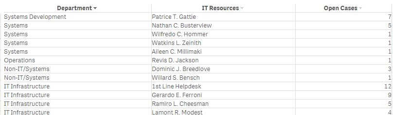
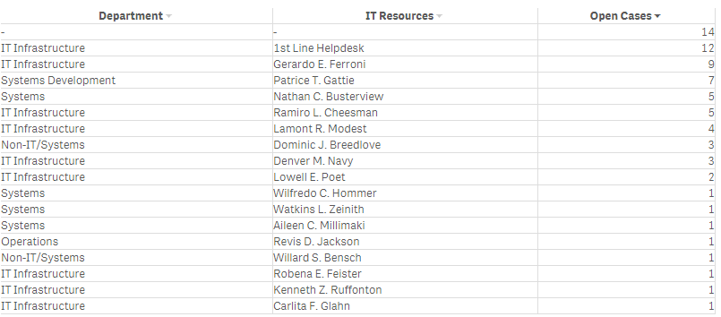
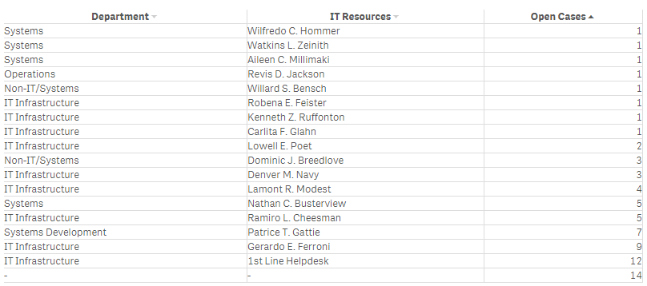

# qsDynamicTable
Dynamic table extension for Qlik Sense

Table with support for dynamically reordering of data.

-Click on a header to set the column to be the primary used for sorting.

-Click on an arrow in the header to reverse sort order.

-Current sort order is displayed in the header with a black arrow for the primary sort column and a gray for other columns.

Also supports selections and simple paging.

